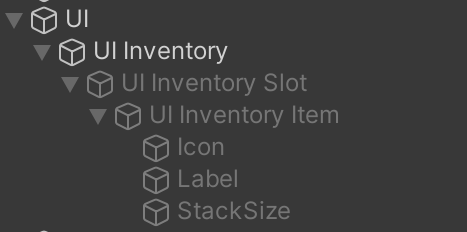

# How to use
## Backend
Add 'Inventory' MonoBehaviour to Game Object. This has the benefit of being able to inspect inventory slots in the editor in runtime.
To use, simply get a reference to the inventory object.

### Public Methods
- `AddItem()`
- `RemoveItem()`
- `GetItems()`
- `FillSpace()` 
- `ClearInventory()`
- `PrintInventory()`
- `IsEmpty()`
- `IsFull()`
### Events
- `OnItemAdded`
- `OnItemRemoved`
- `OnItemUsed`

Each event will pass in the `InventorySlot` object, which contains info about stack size, item data, custom behaviour objects.

Since `InventorySlot` objects are passed by reference. Changing the object will directly modify the actual inventory

## UI 


## Adding a Controller
The Inventory Controller helps bridge the gap between Inventory Model and UI  
A single inventory can have multiple UI objects showing the inventory  
Items added to inventory can be controlled
- Possible to add filters so that inventory only accept some items

The `InventoryController` Class:
```cs
using InventorySystem;
using System;
using UnityEngine;

[RequireComponent(typeof(Inventory))]
public class InventoryController : MonoBehaviour
{
    private Inventory inventory;
    [SerializeField] private UI_Inventory uiInventory;

    public event Action<ItemDataSO> OnItemCollected;
    private void Start()
    {
        inventory = GetComponent<Inventory>();
        uiInventory.AssignInventory(inventory);

    }
    public void AddCollectibleToInventory(ItemDataSO data)
    {
        inventory.AddItem(data, 1);
        OnItemCollected?.Invoke(data);
    }
}
```
